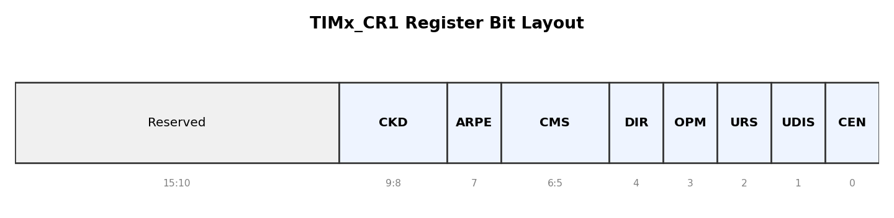
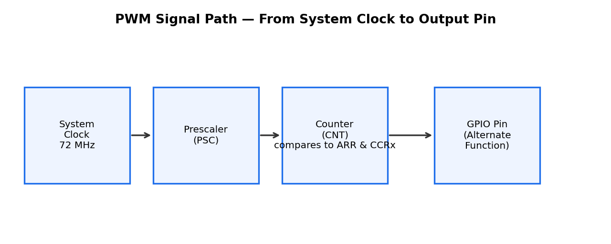
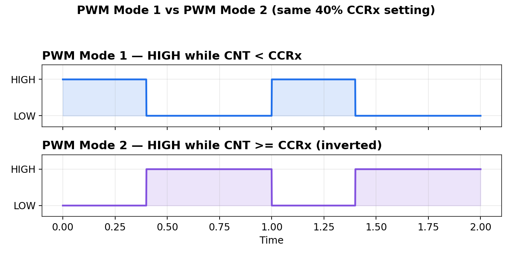
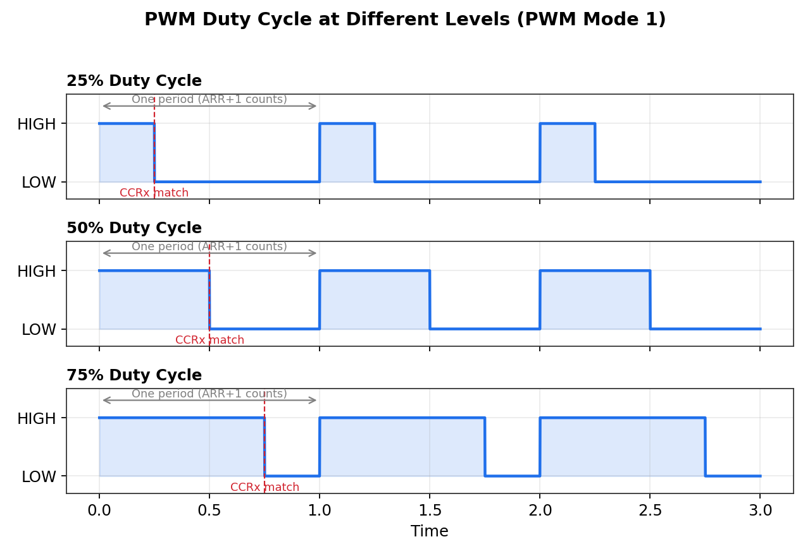
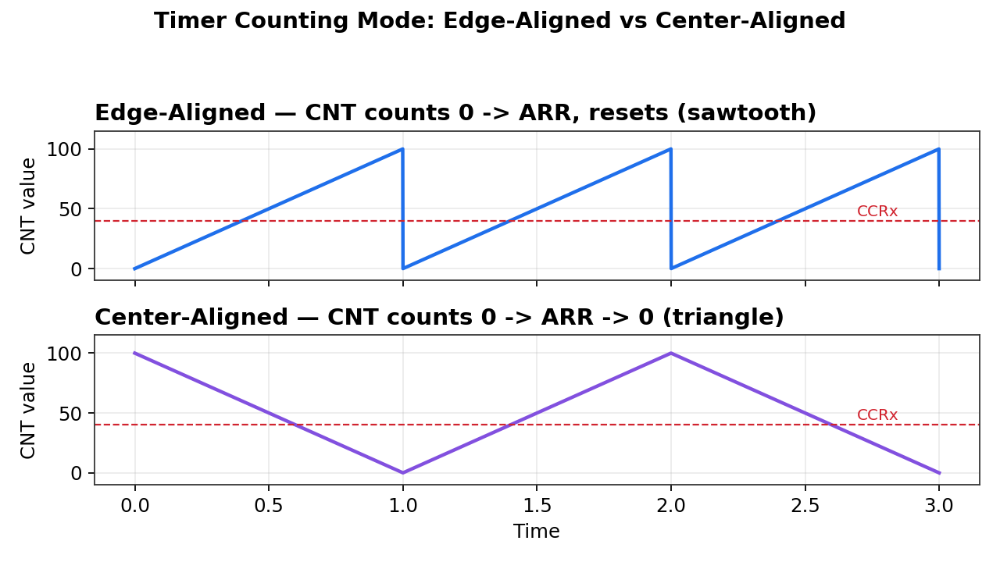

# STM32F1 Timer — Complete Reference
*A standalone, timer-only overview. Covers general-purpose timers, PWM, the CR1 register, and frequency calculations.*

## Contents
1. What a Timer Is
2. Which Timers Exist on F103, and Which Bus They're On
3. Core Registers Overview
4. CR1 — The Main Control Register
5. Prescaler (PSC) and Auto-Reload (ARR)
6. Frequency Formula (with worked example)
7. Capture/Compare Registers (CCRx) — Compare and Capture
8. PWM Mode 1 vs PWM Mode 2
9. Edge-Aligned vs Center-Aligned Counting
10. `timer_set_mode()` — What It Actually Sets
11. Typical PWM Setup Sequence
12. Timer Interrupts
13. Quick Reference Summary

---

## 1. What a Timer Is

A timer is a **hardware counter** — a register that automatically increments by 1 every clock tick, entirely in hardware, with no CPU involvement. The CPU can read the current count, get interrupted when it reaches a target value, or let it drive another peripheral (like a GPIO output pin), while the main program is free to do something else entirely.

This is fundamentally different from a software busy-wait loop (`for (i = 0; i < 5000000; i++) { nop; }`), which occupies the CPU 100% of the time just counting, and produces only an approximate delay.

---

## 2. Which Timers Exist on F103, and Which Bus They're On

Per RM0008's memory map (Table 3):

| Timer | Bus | Notes |
|---|---|---|
| TIM1, TIM8 | APB2 | "Advanced-control" timers — extra features aimed at motor control |
| TIM2, TIM3, TIM4 (TIM5 on some variants) | APB1 | Standard general-purpose timers |
| TIM9, TIM10, TIM11 | APB2 | Simpler general-purpose timers, fewer channels/features |

**Why the bus matters practically:** it determines which RCC register you enable the timer's clock in.
```c
rcc_periph_clock_enable(RCC_TIM2);   // sets a bit in RCC_APB1ENR
rcc_periph_clock_enable(RCC_TIM1);   // sets a bit in RCC_APB2ENR
```
Same underlying rule as GPIO: **every peripheral's clock is disabled by default** and must be explicitly enabled before any of its registers will have real effect.

---

## 3. Core Registers Overview

| Register | Purpose |
|---|---|
| `CR1` | Main control — counting direction, alignment, enable/disable, clock division |
| `PSC` | Prescaler — divides the input clock down to a usable counting rate |
| `ARR` | Auto-Reload — the value `CNT` counts up to before wrapping around (defines cycle length) |
| `CNT` | Counter — the actual live, running count |
| `CCR1`-`CCR4` | Capture/Compare — per-channel compare value (PWM duty cycle) or captured input timing value |
| `CCMRx` | Capture/Compare Mode — selects PWM Mode 1/2, or input capture mode, per channel |
| `CCER` | Capture/Compare Enable — turns each channel's output/input on or off |

---

## 4. CR1 — The Main Control Register

`TIMx_CR1` configures a timer's fundamental counting behavior — the timer equivalent of what `CRL`/`CRH` are for GPIO, except configuring one timer's overall mode instead of 16 pins.



| Bit(s) | Field | Meaning |
|---|---|---|
| 0 | **CEN** | Counter Enable — the master on/off switch. `0` = stopped, `1` = actively counting. Nothing runs until this is set. |
| 1 | **UDIS** | Update Disable — can suppress update events (the wraparound event at ARR) without stopping the counter |
| 2 | **URS** | Update Request Source — controls exactly which conditions generate an update interrupt |
| 3 | **OPM** | One Pulse Mode — if set, the counter automatically stops itself after the next update event, instead of running forever. Used for generating a single timed pulse instead of a continuous signal. |
| 4 | **DIR** | Direction — counts up (`0`) or down (`1`). Only relevant in edge-aligned mode; center-aligned mode handles direction automatically. |
| 6:5 | **CMS** | Center-aligned mode selection — edge-aligned, or one of three center-aligned variants |
| 7 | **ARPE** | Auto-reload preload enable — `0` = a new ARR value applies immediately, even mid-cycle (can glitch); `1` = a new ARR value is buffered and only applied at the next update event (smooth) |
| 9:8 | **CKD** | Clock division — sets a separate, slower sampling clock used only for digital filtering on external input signals (ETR, TIx). Unrelated to PWM output speed. |

**CKD in more detail — what it actually filters**

CKD only matters when a timer channel is configured as an *input* (reading an incoming signal), not for PWM *output*. Real-world signals aren't perfectly clean — e.g. a mechanical button can "bounce" (flicker HIGH/LOW rapidly before settling). Instead of reacting to a single instantaneous change, the timer's digital filter requires the input to stay stable across several consecutive samples, spaced apart by an amount CKD controls, before accepting it as a real transition.

| CKD | Sampling clock |
|---|---|
| `00` | Same as timer's internal clock (fastest sampling, least filtering) — default, use this for PWM output |
| `01` | Timer clock / 2 |
| `10` | Timer clock / 4 |
| `11` | Reserved |

More spacing between samples = better noise rejection, but slower reaction to genuinely fast real signals. For plain PWM generation, leave this at `00` — it does nothing useful there.

**Bit 0 (CEN) is the "go" switch:** everything else in `CR1`, plus `ARR`/`PSC`/`CCRx` configuration, should be set up first. Only once the timer is fully configured do you set `CEN = 1` (via `timer_enable_counter()` in libopencm3) to actually start it running.

---

## 5. Prescaler (PSC) and Auto-Reload (ARR)

**Prescaler (`PSC`)**

Divides the incoming system clock down before it reaches the counter. The system clock (e.g. 72 MHz) is far too fast for most practical timing directly — a counter incrementing 72 million times a second would be impractical to use for human-scale delays. The prescaler brings this down to a manageable rate.

```
timer_clock = system_clock / (PSC + 1)
```
Note the `+1` — a register value of `0` still means "divide by 1," not "divide by 0."

**Auto-Reload Register (`ARR`)**

Sets the maximum value `CNT` counts up to before automatically resetting to zero (an "update event," which can optionally trigger an interrupt). Combined with the prescaler, this defines exactly how long one full timer cycle takes.

```
freq = timer_clock / (ARR + 1)
```
Again, `+1` — one full cycle covers `ARR + 1` total counts (from 0 up to and including ARR).

---

## 6. Frequency Formula (with worked example)

**Combined formula:**
```
freq = system_clock / ((PSC + 1) x (ARR + 1))
```

This is **multiplication**, not addition — the prescaler and the auto-reload are two separate, sequential division stages. First the raw clock is slowed down (prescaler), then that slower tick is stretched into a full cycle (auto-reload counting up to ARR). Two sequential divisions combine by multiplying their divisors — the same reason gear ratios across multiple bicycle gears multiply together rather than add.

**Worked example — generating exactly 1 Hz (one cycle per second) from a 72 MHz clock:**
```
PSC = 7199   ->  timer_clock = 72,000,000 / 7200 = 10,000 counts/second
ARR = 9999   ->  freq = 10,000 / 10,000 = 1 Hz
```
Verified against the combined formula:
```
freq = 72,000,000 / (7200 x 10000) = 72,000,000 / 72,000,000 = 1 Hz
```

**Practical use:** pick `PSC` first to bring the clock down to a convenient counting rate (often a round number like 1 kHz or 10 kHz, called the "timer tick rate"), then pick `ARR` to set how many of those ticks make up one full cycle at your desired frequency.

---

## 7. Capture/Compare Registers (CCRx) — Compare and Capture

Each general-purpose timer typically has up to 4 independent channels, each with its own `CCRx` register. The same register serves two very different purposes depending on the channel's configured mode.

**Compare mode (output) — this is what PWM uses**

The timer continuously compares its live `CNT` value against `CCRx`:
- `CNT < CCRx` -> output pin behaves one way (HIGH or LOW, depending on PWM mode — see Section 8)
- `CNT >= CCRx` -> output pin behaves the other way

This produces a repeating HIGH/LOW pattern automatically in hardware, with zero CPU involvement after initial setup.

**Capture mode (input) — the reverse use**

Instead of driving an output, the timer **records** the current `CNT` value at the exact moment an input signal edge occurs (e.g. a rising edge on the pin). Used to measure the width of an incoming pulse, or the time between two events — reading an RC receiver's PWM signal, or measuring rotational speed from a sensor.

**Where the output pin connects**

Each timer channel's PWM output has a specific, fixed GPIO pin, documented in RM0008's pinout tables — the same alternate-function mechanism used for SWDIO/SWCLK on PA13/PA14. The GPIO pin's `CNF` bits must be set to "alternate function push-pull" (not plain output) so the timer hardware drives the pin's voltage directly instead of `gpio_set()`/`gpio_clear()`.

---

## 8. PWM Mode 1 vs PWM Mode 2

Selected via the `OCxM` bits within `CCMRx` (Capture/Compare Mode Register).

| Mode | While `CNT < CCRx` | While `CNT >= CCRx` |
|---|---|---|
| **PWM Mode 1** | Output HIGH (active) | Output LOW (inactive) |
| **PWM Mode 2** | Output LOW (inactive) | Output HIGH (active) |

PWM Mode 1 is the far more common default — "channel active while counting up to the compare value." PWM Mode 2 is simply the electrical inverse, useful when a design needs an inverted signal without adding an external inverter circuit (e.g. driving a component that expects "active LOW" logic).







**Duty cycle formula:**
```
Duty Cycle % = (CCRx / (ARR + 1)) x 100
```
Example: `ARR = 999`, `CCRx = 250` -> duty cycle = 250/1000 = 25%.

**Changing brightness/speed while running:** once the timer is running, updating just `CCRx` (e.g. in a loop, or based on a sensor reading) changes the duty cycle immediately. The timer hardware keeps generating the waveform continuously — the CPU only needs to occasionally write a new `CCRx` value, not manage the signal itself.

---

## 9. Edge-Aligned vs Center-Aligned Counting

Set via `CMS` (bits 6:5 in `CR1`).

- **Edge-aligned (`CMS = 00`, default)** — `CNT` counts straight up from 0 to `ARR`, resets to 0, repeats (sawtooth pattern). Direction is set separately by `DIR`. The PWM pulse always starts at the same edge of each cycle.
- **Center-aligned (`CMS = 01/10/11`)** — `CNT` counts up from 0 to `ARR`, then back down to 0, repeatedly (triangle-wave pattern). The PWM pulse is centered within each cycle. Matters for motor control, where symmetric switching reduces electrical noise/ripple — a more advanced use case, not needed for basic LED dimming or servo control. The three center-aligned variants differ only in *when* the compare-match interrupt flag is set (only counting down, only counting up, or both) — for basic PWM output without using that interrupt, the choice usually doesn't matter.

**Note:** switching between edge-aligned and center-aligned is not allowed while the counter is running (`CEN = 1`) — must be set before starting the timer.



The dashed line in both plots marks the same `CCRx` value — in edge-aligned mode, `CNT` crosses it once per cycle; in center-aligned mode, `CNT` crosses it twice per cycle (once counting up, once counting down), which produces the centered, symmetric pulse.

---

## 10. `timer_set_mode()` — What It Actually Sets

```c
void timer_set_mode(uint32_t timer_peripheral, uint32_t clock_div,
                     uint32_t alignment, uint32_t direction);
```

A libopencm3 convenience function that writes directly to the `CR1` bit-fields covered in Section 4:

| Parameter | Sets which `CR1` bits |
|---|---|
| `clock_div` | `CKD` (bits 9:8) |
| `alignment` | `CMS` (bits 6:5) |
| `direction` | `DIR` (bit 4) |

**Typical call for basic PWM:**
```c
timer_set_mode(TIM2,
               TIM_CR1_CKD_CK_INT,   // no clock division
               TIM_CR1_CMS_EDGE,     // edge-aligned (simplest)
               TIM_CR1_DIR_UP);      // count upward
```

This is a one-time setup call, same pattern as `gpio_set_mode()` — configure the peripheral's basic operating mode once, before touching anything else. Other functions handle the remaining registers: `timer_set_prescaler()` (PSC), `timer_set_period()` (ARR), `timer_set_oc_value()` (CCRx), `timer_enable_counter()` (CEN in CR1).

---

## 11. Typical PWM Setup Sequence

1. `rcc_periph_clock_enable(RCC_TIMx)` — enable the timer's clock (same RCC pattern as GPIO)
2. Configure the GPIO pin tied to that timer channel as **alternate function push-pull**, not plain output — hands control of the pin's voltage to the timer hardware
3. `timer_set_mode(...)` — set CKD, CMS, DIR (Section 10)
4. Set `PSC` and `ARR` — defines the PWM frequency (Sections 5-6)
5. Set the desired `CCRx` — defines the duty cycle (Section 7-8)
6. Configure `CCMRx` for PWM Mode 1 (or 2) — Section 8
7. Enable the specific channel's output via `CCER`
8. `timer_enable_counter()` — sets `CEN = 1` in `CR1`, starts the timer running. PWM output begins immediately, entirely in hardware.

---

## 12. Timer Interrupts

Timers can generate two broad interrupt types:

- **Update interrupt** — fires when `CNT` wraps around at `ARR` (an "update event"). Useful for periodic tasks — sensor polling, control loop timing, anything that should run at a fixed interval.
- **Capture/compare interrupt** — fires when a `CCRx` match (compare mode) or capture event (input mode) occurs.

**How it connects to the interrupt vector table:** handled the same way as any peripheral interrupt — write a function with the correct matching name (e.g. `tim2_isr()`), and the startup code's vector table automatically routes the timer's interrupt to it. This naming convention has to be exact, or the handler silently never runs.

**Two-step enable, generally required for any peripheral interrupt (not unique to timers):**
1. Enable the specific interrupt condition in the peripheral's own registers (e.g. an "enable update interrupt" bit)
2. Separately enable that interrupt line in the NVIC (the core-level interrupt controller)

---

## 13. Quick Reference Summary

| Concept | Key fact |
|---|---|
| What a timer is | A hardware counter, incrementing automatically, no CPU involvement |
| Bus placement | TIM1/TIM8/TIM9-11 on APB2, TIM2-5 on APB1 — determines which RCC enable register to use |
| `CEN` (CR1 bit 0) | Master start/stop switch — set last, after everything else is configured |
| `PSC` | Divides system clock down to a usable counting rate; register value is `divisor - 1` |
| `ARR` | Max count before wraparound; defines cycle length; register value is `count - 1` |
| Frequency formula | `freq = system_clock / ((PSC+1) x (ARR+1))` |
| `CCRx` | Compare mode -> PWM duty cycle; Capture mode -> records CNT on an input edge |
| Duty cycle formula | `(CCRx / (ARR+1)) x 100` |
| PWM Mode 1 | HIGH while `CNT < CCRx` (most common) |
| PWM Mode 2 | LOW while `CNT < CCRx` (inverted) |
| Edge-aligned | Sawtooth counting, pulse starts at a fixed edge each cycle |
| Center-aligned | Triangle counting, pulse centered within each cycle — used in motor control |
| `CKD` | Only affects input-signal noise filtering (ETR/TIx) — irrelevant to PWM output |
| `ARPE` | `1` = ARR changes apply cleanly at next cycle, not mid-cycle |
| `timer_set_mode()` | Sets CKD, CMS, DIR in one call — the timer's counting "shape" |