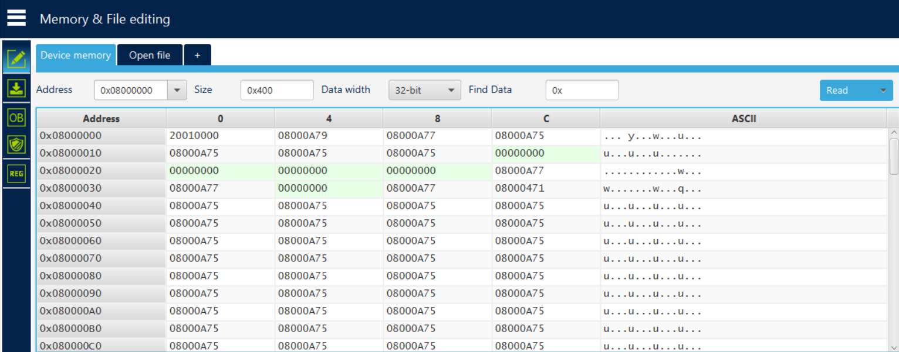

# STM32F103 Flash মেমোরি ও Vector Table ব্যাখ্যা

*(STM32CubeProgrammer-এ Device Memory থেকে পড়া `0x08000000` থেকে শুরু হওয়া ডেটার সম্পূর্ণ ব্যাখ্যা)*



---

## ১. Vector Table কী

মাইক্রোকন্ট্রোলার চালু হওয়ার সাথে সাথে বা কোনো বিশেষ ঘটনা (event/interrupt) ঘটলে — যেমন reset, error, timer শেষ হওয়া — চিপকে জানতে হয় **"এখন কোন function চালাতে হবে?"**

**Vector table** হলো একটি তালিকা যেখানে প্রতিটা ঘটনার জন্য একটা করে **address (ঠিকানা)** লেখা থাকে। সেই address-এ গেলেই সংশ্লিষ্ট function (handler) পাওয়া যায়। এই টেবিল সাধারণত flash-এর শুরুতে থাকে। STM32 reset হওয়ার পরে প্রথমে vector table থেকে initial stack pointer এবং reset handler address পড়ে।

এই project-এ দুইটা গুরুত্বপূর্ণ vector table থাকতে পারে:

- bootloader vector table: `0x08000000`
- main application vector table: `0x08008000`

কারণ bootloader প্রথমে চলে, তারপর দরকার হলে main application-এ jump করে।

---

## ২. মেমোরি টেবিলের কলাম (Address, 0, 4, 8, C) মানে কী

CubeProgrammer-এর Device Memory ভিউতে **Data width = 32-bit** সিলেক্ট করা থাকলে প্রতিটা value 4 বাইট করে হয়, তাই কলামগুলো 4 করে দূরত্বে সাজানো থাকে: `0, 4, 8, C`। Hex-এ `C` মানে decimal-এ 12।

প্রতিটা row-তে একটা **শুরুর address** থাকে বাম পাশে, আর তার পাশের চারটা কলাম হলো তার থেকে 0, 4, 8, 12 বাইট পরের value।

### উদাহরণ

| Row Address | কলাম | প্রকৃত মেমোরি address | Value |
|---|---|---|---|
| `0x08000000` | 0 | `0x08000000 + 0x0` = `0x08000000` | `20010000` |
| `0x08000000` | 4 | `0x08000000 + 0x4` = `0x08000004` | `08000A79` |
| `0x08000000` | 8 | `0x08000000 + 0x8` = `0x08000008` | `08000A77` |
| `0x08000000` | C | `0x08000000 + 0xC` = `0x0800000C` | `08000A75` |

**সহজ কথায়:** `0, 4, 8, C` শুধু বলছে "row-এর শুরু থেকে কতদূরে" সেই value আছে। এটা ডেটার অর্থ না, শুধু layout দেখানোর label।

---

## ৩. সম্পূর্ণ Vector Table — লাইন ধরে ব্যাখ্যা

| Address | Value | এটা কীসের জন্য | ব্যাখ্যা |
|---|---|---|---|
| `0x08000000` | `20010000` | **Stack Pointer** | RAM-এর সবচেয়ে উপরের ঠিকানা। program শুরু করার সময় CPU এখানে stack বসায়। |
| `0x08000004` | `08000A79` | **Reset Handler** | চিপ চালু বা reset হলে সবার আগে এই function চলে। এখান থেকেই পরে `main()`-এ যাওয়ার রাস্তা তৈরি হয়। |
| `0x08000008` | `08000A77` | **NMI Handler** | খুব জরুরি error হলে চলে। NMI মানে Non-Maskable Interrupt। |
| `0x0800000C` | `08000A75` | **HardFault Handler** | মারাত্মক ভুল বা crash হলে চলে। |
| `0x08000010` | `08000A75` | **MemManage Handler** | memory access-এ ভুল হলে চলে। |
| `0x08000014` | `08000A75` | **BusFault Handler** | bus বা memory/data transfer-এ সমস্যা হলে চলে। |
| `0x08000018` | `08000A75` | **UsageFault Handler** | ভুল instruction বা invalid CPU operation হলে চলে। |
| `0x0800001C` থেকে `0x08000028` | `00000000` | **Reserved** | ARM নিজের জন্য রেখে দিয়েছে। এখানে handler নেই। |
| `0x0800002C` | `08000A77` | **SVCall Handler** | RTOS/OS service call ব্যবহার করলে দরকার হয়। |
| `0x08000030` | `08000A77` | **Debug Monitor** | debugging-এর জন্য ব্যবহৃত হয়। |
| `0x08000034` | `00000000` | **Reserved** | খালি। |
| `0x08000038` | `08000A77` | **PendSV Handler** | RTOS task switch করার জন্য ব্যবহার হয়। |
| `0x0800003C` | `08000471` | **SysTick Handler** | নিয়মিত timer interrupt হলে চলে। address আলাদা, মানে এই handler project-এ আলাদাভাবে আছে। |
| `0x08000040` এবং তার পরের entries | `08000A75` বারবার | **External Interrupts** | Timer, USART, DMA ইত্যাদি peripheral interrupt-এর entry। |

---

## ৪. `08000A75` এত জায়গায় বারবার কেন

লক্ষ্য করলে দেখা যায় বেশিরভাগ entry-তে একই address `08000A75` বসানো।

এর মানে হলো এই handler-গুলো, যেমন HardFault, MemManage, বেশিরভাগ IRQ, তুমি নিজে আলাদা করে লিখো/handle করোনি। তাই startup code এগুলোকে একটা **common function**-এ পাঠিয়ে দিয়েছে।

এই common function-কে সাধারণত বলা হয়:

```c
Default_Handler
```

সাধারণত এটা শুধু infinite loop:

```c
while (1) {
}
```

মানে কোনো unexpected interrupt বা fault হলে CPU সেখানে আটকে থাকবে।

যেগুলো **আলাদা** address দেখাচ্ছে, সেগুলো গুরুত্বপূর্ণ:

- `08000A79` reset handler: আলাদা, কারণ এটা program startup চালায়
- `08000471` SysTick handler: আলাদা, কারণ timer interrupt-এর জন্য আলাদা function আছে

---

## ৫. ASCII কলামে "y", "w", "u" কেন দেখাচ্ছে

মেমোরি viewer-এর ডান পাশে একটা **ASCII কলাম** থাকে। এটা প্রতিটা byte-কে printable character হিসেবে দেখানোর চেষ্টা করে, এমনকি সেই byte আসলে text না হলেও।

তোমার vector table-এর address-গুলোর শেষ byte-কে ASCII হিসেবে পড়লে:

| Hex value | ASCII অক্ষর |
|---|---|
| `0x79` | `y` |
| `0x77` | `w` |
| `0x75` | `u` |

তাই `08000A79`, `08000A77`, `08000A75` — এই address-গুলোর কারণে ASCII কলামে `y`, `w`, `u` দেখা যায়।

এটা কোনো প্রকৃত text বা UART data না। এটা শুধু coincidence, কারণ address-এর কিছু byte printable ASCII range-এ পড়েছে।

যেসব byte printable না, যেমন `0x08`, `0x00`, `0x0A`, সেগুলোর জায়গায় viewer সাধারণত একটা dot (`.`) দেখায়।

---

## ৬. UART ডেটা কোথায় খুঁজবে

UART শুধু data **আনা-নেওয়ার মাধ্যম**। একবার data chip-এর ভিতরে চলে গেলে UART connected থাকা বা না থাকা গুরুত্বপূর্ণ না।

যদি data flash-এ লেখা হয়, তাহলে সেটা reset/power off-এর পরেও থাকে।

যদি data শুধু RAM buffer-এ থাকে, তাহলে reset/power off হলে সেটা হারিয়ে যায়।

| ডেটা কোথায় সংরক্ষিত | পড়ার আগে কী মনে রাখতে হবে |
|---|---|
| **Flash-এ লেখা** | Non-volatile। reset/power cycle-এর পরেও থাকে। ST-Link দিয়ে যেকোনো সময় পড়া যায়। |
| **শুধু RAM buffer-এ** | Volatile। reset বা power off হলে হারিয়ে যায়। reset করার আগেই ST-Link দিয়ে পড়তে হবে। |

**গুরুত্বপূর্ণ:** ST-Link দিয়ে flash পড়ার জন্য UART সংযুক্ত থাকার দরকার নেই। ST-Link সরাসরি SWD debug port দিয়ে memory পড়ে। Firmware চলছে কিনা, সেটার উপরও flash read নির্ভর করে না।

---

## ৭. Bootloader-এর সাথে সম্পর্ক

এই project-এ bootloader এবং main application আলাদা address-এ থাকে:

```text
0x08000000  bootloader starts here
0x08008000  main application starts here
```

Reset হলে CPU প্রথমে `0x08000000` থেকে bootloader-এর vector table পড়ে।

Bootloader যখন main application চালাতে চায়, তখন তাকে main application-এর vector table পড়তে হয়:

```c
const uint32_t *app_vector_table = (const uint32_t *)MAIN_APP_START_ADDRESS;
const uint32_t app_stack = app_vector_table[0];
const uint32_t app_reset = app_vector_table[1];
```

এখানে:

- `app_vector_table[0]` = application-এর initial stack pointer
- `app_vector_table[1]` = application-এর reset handler address

তারপর bootloader:

- `SCB_VTOR` update করে application vector table-এর address দেয়
- CPU stack pointer application-এর stack pointer-এ set করে
- reset handler address-এ branch করে

এটাই bootloader থেকে application-এ jump করার মূল ধারণা।

---

## ৮. সংক্ষিপ্ত সারকথা

- **Vector table** = কোন ঘটনায় কোন function চলবে তার address list।
- STM32 reset হলে প্রথমে vector table থেকে stack pointer এবং reset handler পড়ে।
- `0, 4, 8, C` column = শুধু byte offset label।
- বারবার আসা `08000A75` = unused handler-গুলো common `Default_Handler`-এ যাচ্ছে।
- ASCII column-এর `y/w/u` = address byte printable হওয়ার coincidence, actual text না।
- UART data খুঁজতে হলে দেখতে হবে সেটা flash-এ লেখা হয়েছে, নাকি শুধু RAM buffer-এ আছে।
- Bootloader-এর vector table `0x08000000`-এ, application-এর vector table `0x08008000`-এ।

## Related files

- [Bootloader main file](../bootloader/src/bootloader.c)
- [Flash implementation](../bootloader/src/bl-flash.c)
- [Bootloader skeleton notes](bootloader_skeleton.md)
- [Flash writing notes](bl-flash.md)
